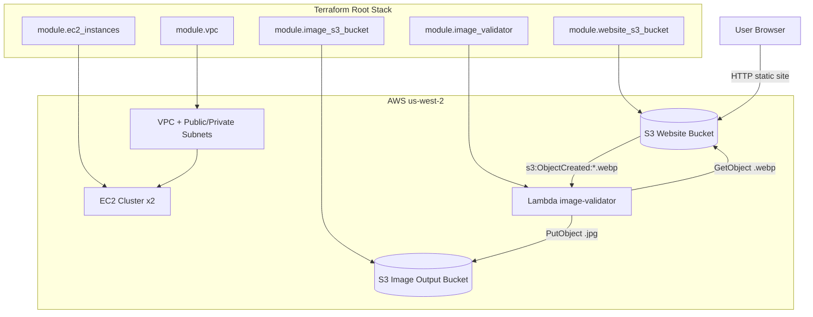

# terraform-aws-s3-bucket

Terraform project that provisions:

- A VPC and networking stack
- Two EC2 instances
- A public S3 static website bucket
- A private S3 image storage bucket
- A Lambda function that converts uploaded `.webp` images to `.jpg`

## Architecture Diagram



## What This Repository Contains

### Root stack

The root Terraform configuration wires together all modules in [main.tf](main.tf).

### Local modules

- `modules/aws-s3-bucket-static-websites`: Public S3 static website bucket
- `modules/aws-s3-bucket-image-storage`: Private S3 image storage bucket
- `modules/lambda-image-validator`: Lambda packaging, IAM role/policies, and S3 trigger

### Lambda source

- `lambda/image-validator/src/handler.ts`: Handles S3 object-create events, validates `.webp`, converts to JPEG with `sharp`, and uploads the output image

### Terraform test assets

- `tests/website.tftest.hcl`: Terraform test that validates helper/module behavior
- `tests/helpers/s3-website-helper`: Test helper module used by `terraform test`

## Prerequisites

- AWS account
- Terraform CLI (1.2+; project pins `~> 1.2`)
- AWS CLI
- Node.js and npm (for Lambda TypeScript utilities)

Verify tooling:

```bash
terraform --version
aws --version
node --version
npm --version
```

## Configuration

The AWS provider in [main.tf](main.tf) reads these Terraform variables:

- `aws_access_key_id`
- `aws_secret_access_key`

You can export them via [env.dev](env.dev):

```bash
source env.dev
```

This script maps your shell AWS credentials to Terraform variables:

- `TF_VAR_aws_access_key_id`
- `TF_VAR_aws_secret_access_key`

## Deploy

```bash
terraform init
terraform plan
terraform apply
```

After apply, inspect outputs:

```bash
terraform output
terraform output website_bucket_domain
terraform output lambda_function_name
```

## Use The Static Website Bucket

Upload static assets to the website bucket:

```bash
aws s3 cp modules/aws-s3-bucket-static-websites/simple-static-website/ \
  "s3://$(terraform output -raw website_bucket_name)/" \
  --recursive
```

Then open the website endpoint returned by:

```bash
terraform output -raw website_bucket_domain
```

## Trigger Image Conversion

The Lambda trigger is configured on the website bucket for object-create events with `.webp` suffix.

Upload a `.webp` file to the website bucket:

```bash
aws s3 cp ./example.webp "s3://$(terraform output -raw website_bucket_name)/example.webp"
```

If Lambda succeeds, a `.jpg` version is uploaded to the output bucket from `image_bucket_name`.

```bash
terraform output image_bucket_name
```

## Tests

### Terraform tests

```bash
terraform test
```

### TypeScript checks/build

```bash
npm install
npm run typecheck
npm run build
```

Note: [lambda/image-validator/src/handler.test.ts](lambda/image-validator/src/handler.test.ts) currently exists but is empty.

## Useful Outputs

Defined in [outputs.tf](outputs.tf):

- `vpc_public_subnets`
- `ec2_instance_public_ips`
- `website_bucket_arn`
- `website_bucket_name`
- `website_bucket_domain`
- `image_bucket_arn`
- `image_bucket_name`
- `lambda_function_name`
- `lambda_function_arn`

## Cleanup

```bash
terraform destroy
```

## Notes

- Bucket names in [main.tf](main.tf) are currently hardcoded. They must be globally unique in AWS.
- The npm script `upload:image` in [package.json](package.json) uploads to a hardcoded bucket name.
